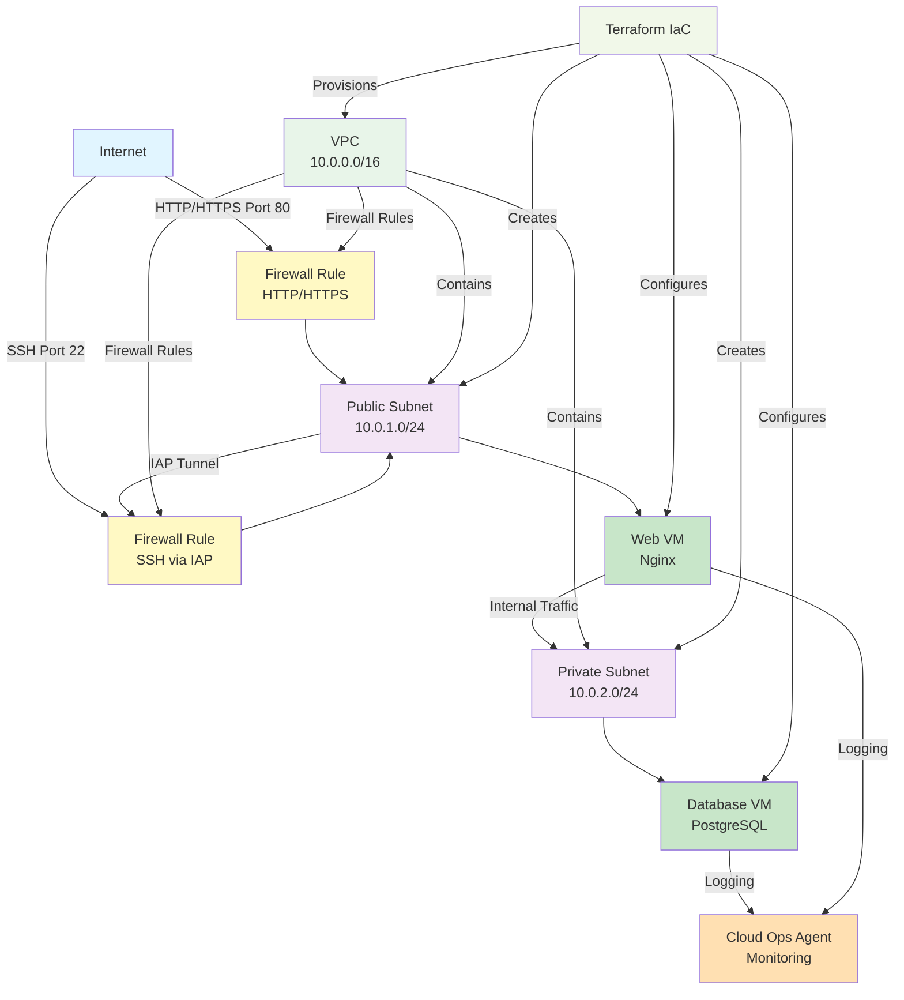

# Proyecto 1 - IaaS en GCP con Terraform

Este proyecto crea una arquitectura IaaS básica en Google Cloud Platform usando Terraform: una VPC personalizada con dos subredes (pública y privada), dos VMs (web y base de datos) y reglas de firewall seguras con acceso SSH vía IAP.

## Arquitectura


- VPC personalizada sin subredes automáticas.
- Subred pública y subred privada en la misma región.
- VM web en la subred pública con Nginx instalado vía startup script.
- VM de base de datos en la subred privada con PostgreSQL simulado.
- Reglas de firewall:
  - HTTP (80) abierto a la VM web desde Internet.
  - SSH (22) permitido solo desde los rangos de IAP.
  - Puerto 5432 permitido solo entre las subredes interna y privada.
- Google Cloud Ops Agent instalado en ambas VMs para monitoreo y logging.

## Requisitos

- Cuenta de GCP y proyecto activo.
- gcloud SDK configurado (`gcloud init`, `gcloud auth application-default login`).
- Terraform >= 1.5 instalado.

## Variables principales

Consulta `variables.tf` para ver todas las variables. Las más importantes:

- `project_id`: ID del proyecto GCP.
- `region`: Región donde se crea la VPC y subredes.
- `zone`: Zona para las VMs.
- `network_name`: Nombre de la VPC.

Puedes definir un archivo `terraform.tfvars`:

```
project_id = "mi-proyecto-gcp"
region     = "us-central1"
zone       = "us-central1-a"
```

## Comandos básicos

```bash
terraform init
terraform fmt
terraform validate
terraform plan
terraform apply
terraform destroy
```

## Acceso y pruebas

Usa IAP para conectarte por SSH:

```bash
gcloud compute ssh web-vm --tunnel-through-iap --zone us-central1-a --project <YOUR_PROJECT_ID>
```

Desde la VM web, puedes conectarte a PostgreSQL en la VM privada usando la IP interna y el puerto 5432.

## Buenas prácticas demostradas

- Infraestructura como código con Terraform.
- Diseño de red segmentada (pública/privada).
- Principio de mínimo privilegio en firewall (IAP para SSH, puertos específicos).
- Observabilidad con Cloud Ops Agent.


## Diagrama de Arquitectura


